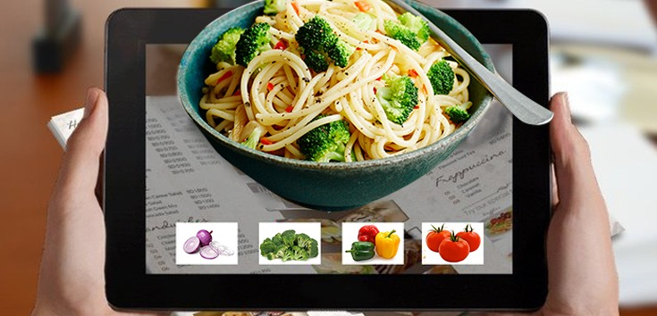

# From Idea to Structure: Understanding What We Actually Built

**Author:** Suhani Garg  
**Tags:** AR, System Design  

---

## Background Context

When we first thought about building an augmented reality–based menu system, the idea felt simple.

Scan a menu → see a 3D food model → interact with it.

It sounded intuitive and exciting. But very early on, we realized something important:

> Having an idea is not the same as having a system.

  

We understood *what* we wanted to build, but not clearly *how it would work*.

---

## The First Set of Questions

During our initial discussion, a few basic questions exposed gaps in our thinking:

- Should we use one marker or multiple markers?
- Does each food item have its own AR trigger?
- What happens after scanning?
- Does a new screen open?
- Do users need to rescan for each item?

  

These weren’t small details — they defined the entire system behavior.

---

## Where We Were Going Wrong

We were thinking in terms of features:

- Show 3D pizza  
- Add interaction  
- Add details  

But we were not thinking in terms of **flow**.

That made our idea feel incomplete, even though it sounded good.

---

## The Shift in Approach

The key realization was:

> A good system is defined by how it behaves, not just what it contains.

So we stepped back and focused on structure first.

---

## Final System Structure

We simplified the design and made clear decisions:

- The system uses **one marker** (menu card / QR)
- Scanning opens **one persistent AR scene**
- All interactions happen inside this scene
- No repeated scanning is required

Inside that scene:

- Users can switch between items using arrows  
- View details like ingredients  
- Interact without leaving AR  

---

## Why This Matters

Without this structure, the project would have remained a basic “scan-and-show” demo.

With this clarity:
- The interaction became continuous  
- The system became scalable  
- The idea became implementable  

---

## Key Learning

The biggest takeaway from this phase was:

> Clarity is more important than complexity.

Even a simple AR system can feel powerful if the interaction flow is well defined.

---

## Conclusion

This stage helped us move from:

👉 “We have a cool idea”  
to  
👉 “We understand how the system actually works”

And that made all the difference.