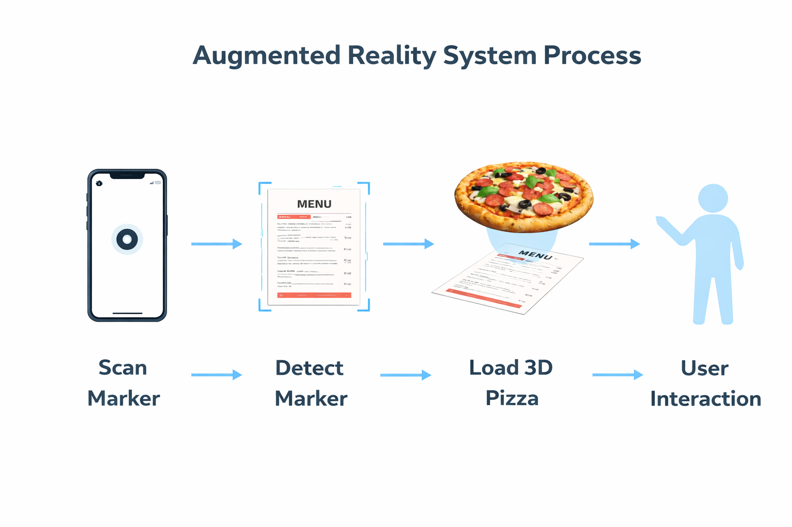
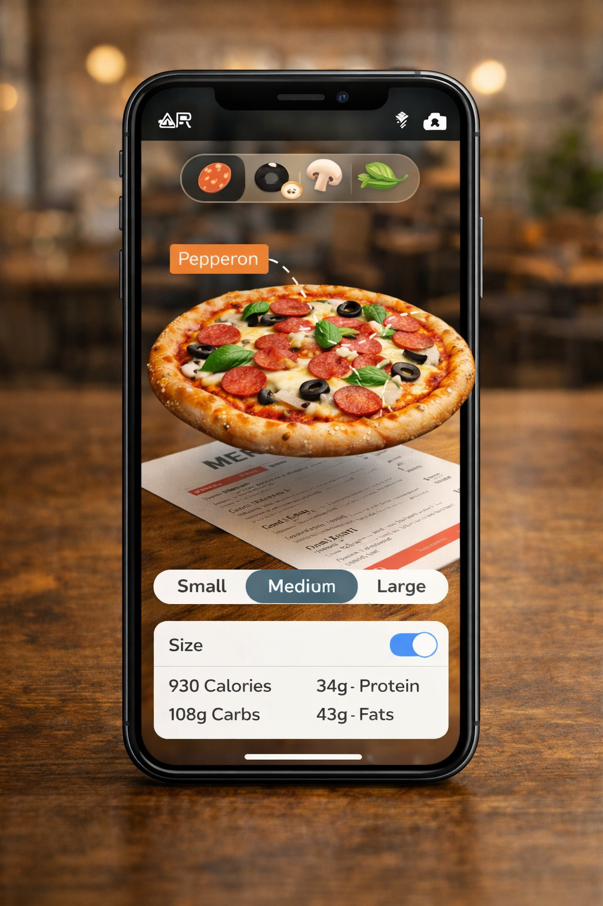

# 🍕 Interactive Marker-Based AR Pizza Menu System

**Author:** Srishti Garg  
**Date:** February 9, 2026  

---

## 📌 Project Overview

The Interactive Marker-Based AR Pizza Menu System is an augmented reality application designed to enhance traditional restaurant menus using immersive 3D visualization.

Instead of relying on text descriptions and small images, this system allows users to:

- Scan a printed menu  
- View realistic 3D pizza models  
- Interact with ingredients  
- Check nutrition information  
- Compare portion sizes visually  

The goal is simple:  
Move from reading about food to experiencing food visually before ordering.

### 🖼 System Preview

{ width="325px" }

---

## 🎯 Motivation

Imagine walking into a café you’ve never visited before.

You look at the menu and see names like:  
Italian Supreme, BBQ Chicken, Veg Delight.

But you still don’t know:

- What exactly is inside?  
- How big is medium?  
- Is it spicy?  

You ask the waiter.  
They explain.  
You ask again.  
They gesture with their hands.

This repeated back-and-forth slows ordering and still doesn’t provide a clear visual understanding.

Our AR system eliminates this confusion.

### 🖼 Traditional Menu Problem

{ width="325px" }

---

## 🏗 System Architecture

### 🔹 Marker-Based AR Model

This project uses marker-based augmented reality.

| Component      | Responsibility |
|---------------|---------------|
| Printed Menu  | Acts as AR Marker |
| Camera Feed   | Detects marker |
| Unity Engine  | Renders 3D Pizza |
| UI Controls   | Handles interaction |

The pizza model is anchored directly to the detected marker, creating a stable AR environment.

### 🖼 Architecture Diagram

{ width="425px" }

---

## 🔄 System Flow

### Step 1 — Marker Detection  
The smartphone camera detects the printed menu marker.

### Step 2 — Scene Initialization  
A single AR scene is created and anchored.

### Step 3 — 3D Pizza Rendering  
A default pizza model appears.

### Step 4 — Interaction  

Users can:
- Navigate between pizzas  
- Change portion size  
- Tap toppings to view ingredient details  
- Toggle nutrition information  

### 🖼 AR Flow Diagram

{ width="425px" }

---

## 🧩 Key Features

### ➤ Arrow-Based Navigation  
Switch between 5–8 predefined pizza varieties without rescanning.

### ➤ Portion Size Visualization  
The 3D model scales dynamically to represent Small, Medium, or Large.

### ➤ Ingredient-Level Interaction  
Each topping is interactive. Selecting it displays its name and description.

### ➤ Nutrition Toggle  
Users can view calorie details and basic health-related information.

### 🖼 Feature Interaction Interface

{ width="325px" }

---

## 📏 Project Scope

The system is intentionally limited to pizza only.

### Included:
- 5–8 pizza varieties  
- Static 3D models  
- Ingredient highlighting  
- Nutrition information  
- Single-marker architecture  

### Not Included:
- Online ordering  
- Payment integration  
- AI recommendations  
- Real-time customization  
- Cloud backend  

This focused scope ensures clarity, stability, and feasibility within an academic environment.

---

## 🛠 Technology Stack

The system is developed using:

- Unity 3D  
- AR Foundation  
- Vuforia SDK  
- Marker-Based AR  
- 3D Pizza Models  
- Android Smartphone Deployment  

The application is currently implemented on Android for ease of testing and deployment but can be extended to iOS.

---

## 🧠 Technical Components Used

- Computer Vision  
- Feature Detection Algorithms  
- Marker Tracking  
- Pose Estimation  
- 3D Rendering  
- UI Integration in AR Space  

---

## 🚀 Expected Outcome

This project demonstrates how augmented reality can transform a static menu into an interactive decision-making tool.

It enhances:

- User confidence  
- Ordering speed  
- Visual clarity  
- Informational transparency  

Rather than being a novelty feature, the AR system functions as a meaningful interface that improves everyday experiences like restaurant ordering.

🔄 Transition to Iteration Phase

While this blog focused on explaining the concept and architecture of the AR Pizza Menu System, the next stage involves refining interaction flow, scene persistence, and implementation stability. The upcoming development blog will document how the system evolves from conceptual design into a structured, stable AR experience.