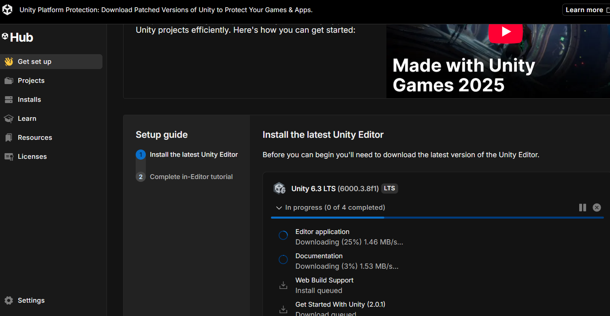

# Platform Constraints and Deployment Decisions in AR Development

**Author:** Suhani Garg  
**Focus:** AR Foundation, Deployment Strategy, System Architecture  

---

## Understanding Platform Realities

While planning the frontend development of our AR-based menu system, we encountered an important technical constraint: device compatibility and deployment environment limitations.

Although our system is designed using AR Foundation — which is inherently cross-platform — practical deployment is influenced by the development environment and hardware availability.

  

---

## Why iOS Deployment Was Not Feasible

Our development system runs on Windows. However, building and deploying applications for iOS requires:

- Xcode  
- Apple Developer signing certificates  
- macOS  

Unity exports iOS builds as Xcode projects, which can only be compiled and signed on a Mac system. Since macOS was not available in our development setup, deploying directly to an iPhone was not technically feasible.

This limitation is not related to AR Foundation itself, but rather to Apple’s platform restrictions.

---

## Choosing Android with ARCore

To ensure smooth frontend development and real-device testing, we shifted to Android deployment using ARCore.

This allowed us to:

- Build directly from Unity on Windows  
- Test marker detection in real time  
- Validate 3D model placement  
- Implement UI interactions effectively  

Most academic and prototype-level AR projects follow this approach due to its simplicity and flexibility.

---

## Cross-Platform Architecture Perspective

Importantly, our system architecture remains cross-platform.

Since we are using AR Foundation:

- The AR interaction logic is abstracted  
- The same project can support ARKit (iOS) without structural changes  
- Only the build target needs modification  

This means our frontend logic, interaction design, and system structure remain platform-independent.

---

## Engineering Insight

This experience reinforced an important lesson in system design:

Technical feasibility depends not only on ideas, but also on platform constraints and development infrastructure.

Understanding deployment environments early in development prevents delays and ensures realistic planning.

Rather than forcing an impractical build target, we adapted our deployment strategy while preserving architectural flexibility.

---

## Key Takeaway

Effective engineering is not just about building features — it is about making informed technical decisions within real-world constraints.

By choosing Android deployment for development while maintaining cross-platform compatibility, we ensured both practicality and scalability in our AR system.
